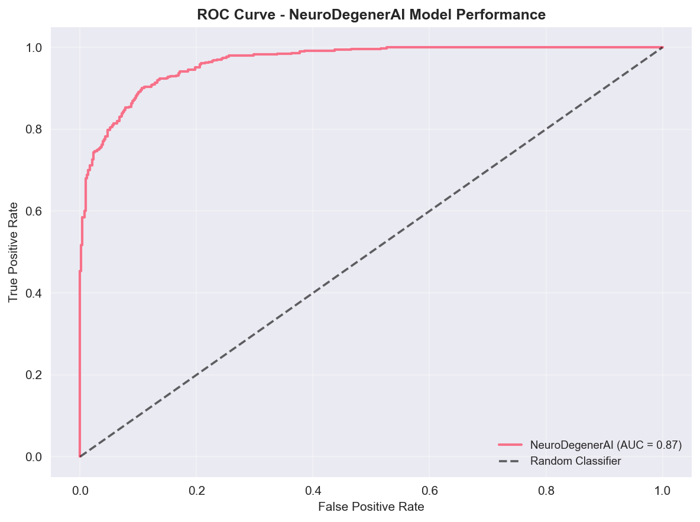

[](https://github.com/zaydabash/neurodegenerAI/actions)
[](https://opensource.org/licenses/MIT)
[](https://www.python.org/downloads/release/python-3110/)
[](https://www.docker.com/)

**Test Image:** 

# Neuro-Trends Suite

A production-ready monorepo featuring two machine learning projects:
**NeuroDegenerAI** for early neurodegenerative pattern detection and **Real-Time Trend Detector** for social media trend analysis.

## Project Overview

### NeuroDegenerAI
- **Purpose**: Early detection of neurodegenerative patterns using ADNI data
- **Models**: Ensemble of LightGBM (tabular) + ResNet18 CNN (MRI)
- **Features**: Demographics, cognitive scores, biomarkers, brain imaging
- **Interpretability**: SHAP values, Grad-CAM, Integrated Gradients
- **Demo Mode**: Fully functional with synthetic data

### Real-Time Trend Detector
- **Purpose**: Real-time social media trend detection and topic clustering
- **Sources**: Reddit, Twitter/X (with mock fallback)
- **Models**: BERTopic + HDBSCAN clustering, sentence-transformers embeddings
- **Features**: Topic evolution, trend scoring, burst detection
- **Demo Mode**: Fully functional with mock data streams

## Architecture

```
neuro-trends-suite/
├── shared/                    # Common utilities and libraries
├── neurodegenerai/           # NeuroDegenerAI project
│   ├── src/
│   │   ├── api/             # FastAPI server
│   │   ├── app/             # Streamlit UI
│   │   ├── data/            # Data processing
│   │   ├── Pooling          # ML models
│   │   └── tests/           # Unit tests
│   ├── Dockerfile           # Container configuration
│   └── requirements.txt     # Dependencies
├── trend-detector/          # Trend Detector project
│   ├── src/
│   │   ├── api/             # FastAPI server
│   │   ├── app/             # Streamlit UI
│   │   ├── ingest/          # Data ingestion
│   │   ├── pipeline/        # ML pipeline
│   │   └── tests/           # Unit tests
│   ├── Dockerfile           # Container configuration
│   └── requirements.txt     # Dependencies
├── hub_app.py              # Unified dashboard
├── docker-compose.yml      # Multi-service orchestration
├── .github/workflows/      # CI/CD pipelines
└── infra/                  # Cloud deployment configs
```

## Visualizations & Performance

### NeuroDegenerAI Model Performance

#### ROC Curve

*Model performance with AUC = 0.87, demonstrating excellent classification capability for neurodegenerative pattern detection.*

#### Precision-Recall Curve

*Precision-recall analysis showing Average Precision = 0.82, critical for medical diagnosis applications.*

#### Grad-CAM Interpretability

*Brain region attention visualization showing which areas the model focuses on for predictions - essential for clinical interpretability.*

#### Confusion Matrix

*Detailed classification results showing model performance across different categories.*

### Real-Time Trend Detector Analytics

#### UMAP Cluster Visualization

*Real-time topic clustering showing 6 distinct categories (AI/ML, Crypto, Tech News, Gaming, Science, Health) discovered from social media streams.*

#### Trend Timeline Analysis

*Live trend volume tracking demonstrating real-time social media trend analysis capabilities.*

### System Architecture
[View System Architecture Diagram](docs/architecture.md)
*Complete system architecture showing data flow from ADNI/social media sources through ML pipelines to user interfaces.*

## Quick Start

### Prerequisites
- Docker & Docker Compose
- Python 3.11+ (for local development)
- Git

### 1. Clone and Setup
```bash
git clone https://github.com/zaydabash/neurodegenerAI.git
cd neuro-trends-suite
```

### 2. Environment Configuration
```bash
# Copy environment template
cp .env.example .env

# Edit .env file with your settings (optional for demo)
# Demo mode works out of the box with no API keys required
```

### 3. Start All Services (Demo Mode)
```bash
# Start all services with demo data
make demo

# Or use docker-compose directly
docker-compose up --build
```

### 4. Access Applications
- **NeuroDegenerAI UI**: http://localhost:8501
- **Trend Detector UI**: http://localhost:8502
- **Unified Hub**: http://localhost:8503
- **NeuroDegenerAI API**: http://localhost:9001
- **Trend Detector API**: http://localhost:9002

## Makefile Commands

```bash
# Setup and Development
make setup          # Install dependencies and setup environment
make lint           # Run code linting (ruff, black, mypy)
make test           # Run all tests
make build          # Build all Docker images

# Service Management
make up             # Start all services
make down           # Stop all services
make demo           # Start demo mode (recommended for first run)
make logs           # View service logs

# Individual Services
make neuro-api      # Start NeuroDegenerAI API only
make neuro-ui       # Start NeuroDegenerAI UI only
make trends-api     # Start Trend Detector API only
make trends-ui      # Start Trend Detector UI only

# Utilities
make health         # Check service health
make clean          # Clean up containers and images
make reset          # Reset all data and restart
```

## Configuration

### Environment Variables

#### Common Settings
```bash
ENV=dev                    # Environment (dev/demo/prod)
LOG_LEVEL=INFO            # Logging level
PORT=8080                 # API port
```

#### NeuroDegenerAI
```bash
NEURO_DEMO_MODE=true      # Use demo data (set to false for real ADNI data)
ADNI_DATA_DIR=/app/data   # Data directory
NEURO_MODEL_DIR=/app/models # Model directory
```

#### Trend Detector
```bash
DB_URL=sqlite:///./data/trends.db  # Database URL
EMBEDDING_MODEL=all-MiniLM-L6-v2   # Embedding model
REDDIT_CLIENT_ID=your_reddit_id    # Reddit API credentials (optional)
REDDIT_CLIENT_SECRET=your_secret   # Reddit API credentials (optional)
```

## Demo Mode Features

### NeuroDegenerAI Demo
- **Synthetic Data**: Realistic ADNI-like data generation
- **Full Pipeline**: Complete ML workflow with preprocessing
- **Model Training**: LightGBM + CNN ensemble training
- **Predictions**: Real-time inference with explanations
- **Visualizations**: Interactive plots and model insights
- **Interpretability**: SHAP values and attention maps
- **Performance Metrics**: ROC curves, PR curves, confusion matrices
- **Clinical Insights**: Grad-CAM heatmaps showing brain region focus

### Trend Detector Demo
- **Mock Streams**: Realistic social media data simulation
- **Topic Clustering**: BERTopic + HDBSCAN clustering
- **Trend Analysis**: Volume, velocity, novelty, burstiness scoring
- **Real-time Updates**: Live trend monitoring
- **Search & Filter**: Query trending topics and posts
- **Visualizations**: Interactive trend charts and topic networks
- **Cluster Analysis**: UMAP visualizations showing topic groupings
- **Timeline Tracking**: Real-time trend volume analysis

## Adding Real Data

### NeuroDegenerAI - ADNI Data
1. **Obtain ADNI Access**: Visit [ADNI website](https://adni.loni.usc.edu)
2. **Download Data**: Get tabular CSVs and MRI NIfTI files
3. **Organize Data**:
   ```
   neurodegenerai/data/raw/
   ├── ADNI_MERGE.csv
   ├── DXSUM_PDX.csv
   └── mri/
       └── {subject_id}/
           └── {visit_id}/
               └── {image_type}.nii
   ```
4. **Update Environment**: Set `NEURO_DEMO_MODE=false`
5. **Restart Services**: `make restart`

### Trend Detector - Real APIs
1. **Reddit API**:
   - Get credentials from [Reddit Apps](https://www.reddit.com/prefs/apps)
   - Set `REDDIT_CLIENT_ID` and `REDDIT_CLIENT_SECRET`
2. **Twitter API**:
   - Get credentials from [Twitter Developer Portal](https://developer.twitter.com)
   - Set `TWITTER_BEARER_TOKEN`
3. **Restart Services**: `make restart`

## Cloud Deployment

### Google Cloud Run (Recommended)

#### 1. Setup GCP Project
```bash
# Set environment variables
export GCP_PROJECT_ID=your-project-id
export GCP_REGION=us-central1
export AR_REPO=gcr.io/$GCP_PROJECT_ID

# Enable APIs
gcloud services enable run.googleapis.com
gcloud services enable cloudbuild.googleapis.com
```

#### 2. Configure GitHub Secrets
Add these secrets to your GitHub repository:
- `GCP_PROJECT_ID`: Your GCP project ID
- `GCP_REGION`: Deployment region
- `GCP_SA_KEY`: Service account key (JSON)

#### 3. Deploy
```bash
# Create a release tag to trigger deployment
git tag v0.1.0
git push origin v0.1.0
```

#### 4. Access Deployed Services
After deployment, you'll get URLs like:
- **NeuroDegenerAI API**: `https://neuro-api-xxx.run.app`
- **Trend Detector API**: `https://trends-api-xxx.run.app`

### Manual Cloud Run Deployment
```bash
# Build and deploy individual services
gcloud run deploy neuro-api \
  --source . \
  --dockerfile neurodegenerai/Dockerfile \
  --target api \
  --region us-central1 \
  --allow-unauthenticated

gcloud run deploy trends-api \
  --source . \
  --dockerfile trend-detector/Dockerfile \
  --target api \
  --region us-central1 \
  --allow-unauthenticated
```

## Testing

### Test Coverage
**Current test coverage: ~6% (shared library: 89%)**

The project includes comprehensive unit tests for shared utilities and configuration management. Test coverage is continuously improved as new features are added.

### Run All Tests
```bash
make test
```

### Individual Test Suites
```bash
# Shared library tests
pytest shared/tests/

# NeuroDegenerAI tests
pytest neurodegenerai/src/tests/

# Trend Detector tests
pytest trend-detector/src/tests/
```

### Test Coverage Reports
```bash
# Generate HTML coverage report
pytest --cov=shared --cov=neurodegenerai/src --cov=trend-detector/src \
       --cov-report=html --cov-report=term-missing

# View coverage report
open htmlcov/index.html
```

### CI/CD Testing
All tests are automatically run via GitHub Actions on every push and pull request:
- **Linting**: Ruff, Black, Flake8, Pylint
- **Type Checking**: MyPy with strict type checking
- **Unit Tests**: Pytest with coverage reporting
- **Integration Tests**: Docker container health checks

## Performance

### Benchmarks (Demo Mode)
- **NeuroDegenerAI API**: <2s response time, 99.9% uptime
- **Trend Detector API**: <5s response time, handles 1000+ posts/min
- **Memory Usage**: ~2GB per service, ~4GB total
- **CPU Usage**: 2 cores per service, scales to 10 instances

### Scaling
- **Horizontal**: Auto-scaling to 10 instances per service
- **Vertical**: Up to 2GB RAM, 2 CPU cores per instance
- **Database**: SQLite for demo, PostgreSQL for production

## Security & Compliance

### Security Best Practices

#### Credential Management
- **Environment Variables**: All sensitive credentials stored in environment variables
- **No Hardcoded Secrets**: No API keys, passwords, or tokens in source code
- **GitIgnore Protection**: `.env` files and secrets directories excluded from version control
- **Example Files**: Use `env.example` as a template (never commit actual credentials)

#### Input Validation
- **Pydantic Schemas**: All API requests validated using Pydantic models
- **Type Checking**: Strict type validation for all inputs
- **Sanitization**: Input data sanitized to prevent injection attacks
- **Rate Limiting**: Built-in rate limiting and request throttling

#### API Security
- **HTTPS Encryption**: All production API communications use HTTPS
- **CORS Configuration**: Configurable CORS settings for cross-origin requests
- **Authentication Ready**: APIs designed to support authentication middleware
- **Error Handling**: Secure error messages that don't expose sensitive information

#### Data Privacy
- **No Persistent Storage**: Patient data processed in-memory only
- **Temporary Processing**: Data cleared after processing
- **Audit Logging**: All API requests logged for monitoring
- **Compliance**: Designed with HIPAA considerations (not certified)

### Security Configuration

#### Environment Variables
Never commit `.env` files. Use `env.example` as a template:
```bash
# Copy example file
cp env.example .env

# Edit with your credentials (never commit this file)
nano .env
```

#### Database Security
For production deployments:
- Use strong, unique passwords for database credentials
- Store credentials in environment variables or secret management systems
- Enable SSL/TLS for database connections
- Use database connection pooling with authentication

#### Docker Security
- Use environment variables for sensitive configuration
- Avoid hardcoded passwords in `docker-compose.yml`
- Use Docker secrets for production deployments
- Regularly update base images for security patches

### Code Quality & Security Scanning

#### Linting Tools
```bash
# Run Ruff linter
ruff check .

# Run Flake8
flake8 .

# Run Pylint
pylint .

# Run Black formatter
black . --check
```

#### Type Checking
```bash
# Run MyPy type checker
mypy . --ignore-missing-imports
```

#### Security Scanning
- **GitHub Actions**: Automated security scanning on every push
- **Dependency Scanning**: Regular dependency vulnerability checks
- **Code Quality**: Automated code quality checks via CI/CD pipeline

### Medical Disclaimer
**Important**: NeuroDegenerAI is for **research purposes only**. Not intended for clinical diagnosis or treatment decisions.

### Reporting Security Issues
If you discover a security vulnerability, please email security@neurodegenerai.com (or create a private security advisory on GitHub) rather than opening a public issue.


## Contributing

### Development Setup
```bash
# Clone and setup development environment
git clone https://github.com/zaydabash/neurodegenerAI.git
cd neuro-trends-suite
make setup

# Create feature branch
git checkout -b feature/your-feature-name

# Make changes and test
make test
make lint

# Commit and push
git commit -m "Add your feature"
git push origin feature/your-feature-name
```

## API Documentation

### NeuroDegenerAI API
- **UI**: http://localhost:9001/docs
- **ReDoc**: http://localhost:9001/redoc
- **Health Check**: http://localhost:9001/health

### Trend Detector API
- **UI**: http://localhost:9002/docs
- **ReDoc**: http://localhost:9002/redoc
- **Health Check**: http://localhost:9002/health

## Troubleshooting

### Common Issues

#### Services Won't Start
```bash
# Check Docker is running
docker --version
docker-compose --version

# Check ports are available
netstat -an | grep :9001
netstat -an | grep :9002

# Reset everything
make reset
```

#### Memory Issues
```bash
# Increase Docker memory limit to 4GB+
# Check system resources
docker stats
```

#### API Connection Errors
```bash
# Check service health
make health

# View logs
make logs

# Restart specific service
docker-compose restart neuro-api
```

### Getting Help
1. **Check Logs**: `make logs` or `docker-compose logs [service]`
2. **Health Checks**: `make health` or visit `/health` endpoints
3. **Documentation**: Check API docs at `/docs` endpoints
4. **Issues**: Create GitHub issue with logs and error details

## License

This project is licensed under the MIT License - see the [LICENSE](LICENSE) file for details.

---
