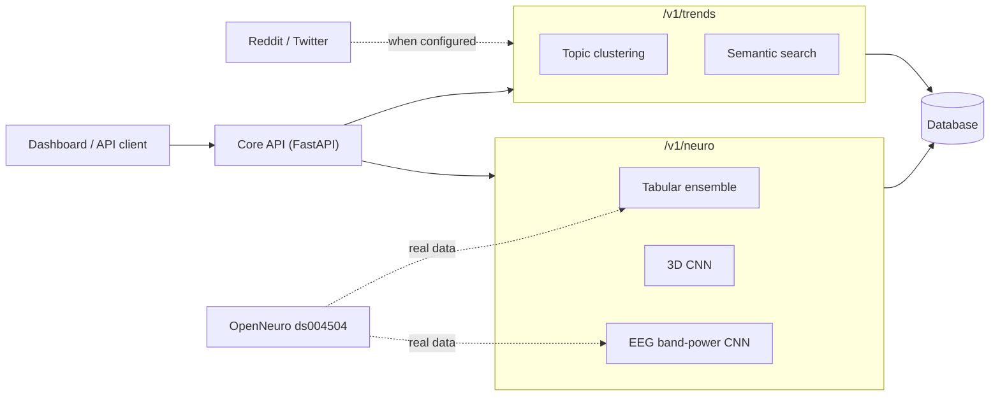
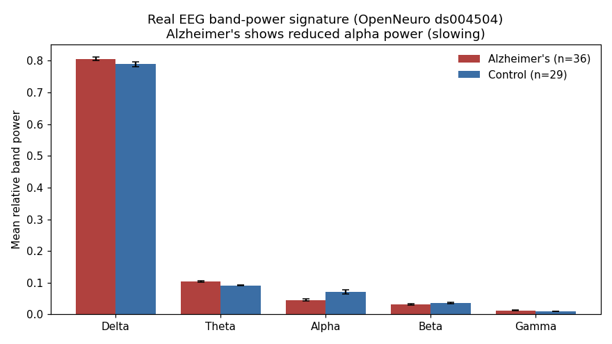
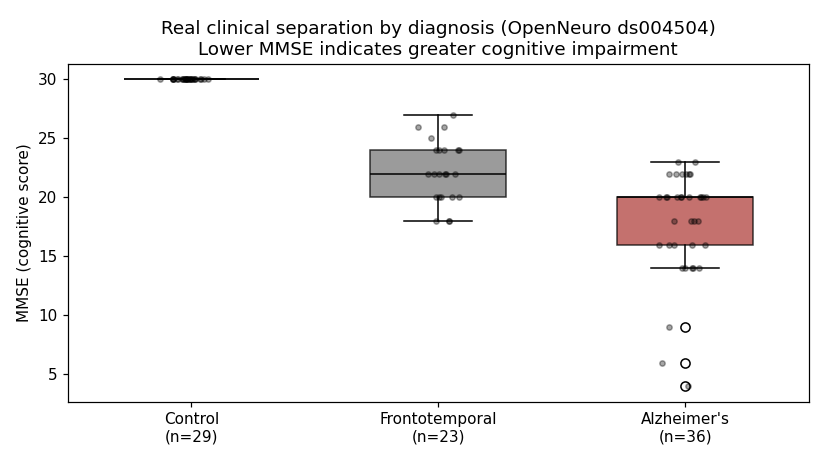
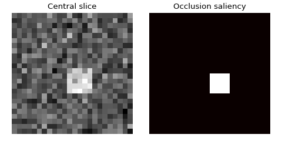

# Neuro-Trends Suite

**Integrated Platform for Neurodegenerative Analysis & Social Intelligence**

A consolidated, hardened system combining advanced neuroscience modeling with real-time social media trend detection. Built for medical research, clinical decision support, and market intelligence.

---

## Architecture Overview

The suite has been **completely refactored** from a fragmented prototype into a unified, production-grade stack:

### Core Components
- **Core API** (`core_api/`): Unified FastAPI gateway serving both Neuro and Trends endpoints
- **Unified Dashboard** (`dashboard_app.py`): Premium Streamlit interface for all analysis modes
- **Persistence Layer**: Predictions, social posts, and trend topics are written to the database (PostgreSQL in Docker, SQLite by default for local runs)
- **Shared Libraries** (`shared/lib/`): Common utilities including PII scrubbing, logging, and database management

### System Diagram



### Legacy Components (Deprecated)
The following directories are **legacy** and will be removed in future versions:
- `neurodegenerai/src/api/` -> Migrated to `core_api/src/api/v1/endpoints/neuro.py`
- `trend_detector/src/api/` -> Migrated to `core_api/src/api/v1/endpoints/trends.py`

---

## Quick Start

### Prerequisites
- Docker & Docker Compose
- Python 3.11+ (for local development)

### Launch the Full Stack
```bash
# Start all services (API, Dashboard, PostgreSQL, pgAdmin)
docker-compose up --build
```

### Local Development
```bash
# Install dependencies
pip install -r requirements.txt

# Run Core API
export PYTHONPATH=$PYTHONPATH:.
python -m uvicorn core_api.src.api.main:app --host 0.0.0.0 --port 8000

# Run Dashboard (in separate terminal)
streamlit run dashboard_app.py --server.port 8501
```

---

## Features

### NeuroDegenerAI
- **Tabular Biomarker Analysis**: Soft-voting ensemble using LightGBM + XGBoost (scikit-learn gradient-boosting/random-forest/logistic ensemble fallback when the native libraries are unavailable)
- **MRI Structural Analysis**: A 3D CNN (`nn.Conv3d`) over the full volume, with an occlusion saliency heatmap
- **EEG Alzheimer's Detection**: A band-power CNN trained on **real EEG** from OpenNeuro ds004504 (Alzheimer's vs healthy controls), evaluated with leakage-free subject-level cross-validation. Run `python scripts/train_eeg_real.py` to download the recordings and build the model; until then the endpoint falls back to a synthetic 1D-CNN state decoder.
- **Real or synthetic training data**: The tabular model trains on real clinical metadata from OpenNeuro **ds004504** (88 subjects: Alzheimer's, frontotemporal dementia, and healthy controls, with Age/Gender/MMSE/diagnosis) when reachable, and falls back to synthetic ADNI-like data offline. Set `NEURO_DATA_SOURCE` to `auto` (default), `real`, or `synthetic`. The active source is reported in every prediction's `model_name` and explanation.
- **Works out of the box**: Models are trained on first use and cached, so every endpoint returns real predictions without shipping an artifact. Disable demo mode to serve your own trained models.
- **Medical Data Validation**: Enforced schemas with range checks for all biomarker inputs
- **PII Protection**: Free-text request metadata is automatically scrubbed before logging/persistence

### Trend Detector
- **Social Monitoring**: Live Reddit and Twitter/X ingestion (with exponential backoff) activate automatically when API credentials are configured; a bundled demo stream is used otherwise
- **Topic Clustering**: BERTopic-powered clustering when available, with a scikit-learn (TF-IDF + KMeans) fallback; `/v1/trends/top` clusters the live/demo corpus on each call
- **Trend Intelligence**: Per-cluster volume, trending score, and recency-based growth rate
- **Semantic Search**: Embedding-based cosine ranking when the sentence-transformers stack is available, with automatic keyword fallback
- **PII-Scrubbed Ingestion**: Every ingested post is automatically redacted before it is searched or stored
- **Persistence**: Returned posts and detected topics are written to the database

---

## Results

### EEG Alzheimer's detection on real data

The EEG model is trained and evaluated on the OpenNeuro ds004504 recordings
(36 Alzheimer's subjects, 29 healthy controls). The figure below shows the
mean relative band power per group, computed directly from the dataset: the
Alzheimer's group shows the characteristic reduction in alpha power and shift
toward slower frequencies.



Evaluated with leakage-free subject-level GroupKFold cross-validation (no
subject appears in both train and test):

| Metric | Value |
| --- | --- |
| Subject-level ROC-AUC | 0.85 |
| Subject-level accuracy | 0.77 |
| Subjects / epochs | 65 / 13,282 |

Reproduce with `python scripts/train_eeg_real.py --max-per-class 40`.

### Clinical separation by diagnosis

The tabular model uses the real ds004504 clinical metadata. MMSE alone already
separates the diagnostic groups clearly, which is why the model is strongly
predictive.



### MRI 3D CNN saliency

Occlusion saliency from the 3D CNN on a demo volume containing a single
injected lesion. The saliency map localizes exactly the region the model relies
on for its prediction, confirming it attends to the lesion rather than
background noise. (Real MRI training requires an ADNI/OASIS Data Use Agreement;
the imaging model ships with a synthetic demo.)



---

## Security & Privacy

### Implemented Safeguards
1. **PII Scrubber**: Automatic redaction of emails, SSNs, phone numbers, and DOBs
2. **Data Validation**: Medical-grade range checks for all biomarker inputs
3. **Structured Logging**: Service-tagged JSON logs with no sensitive data leakage
4. **Database Isolation**: PostgreSQL with connection pooling and prepared statements

### Environment Configuration
Create a `.env` file:
```bash
# Database
POSTGRES_USER=trends
POSTGRES_PASSWORD=your_secure_password
POSTGRES_DB=trends

# Reddit API (Optional)
REDDIT_CLIENT_ID=your_client_id
REDDIT_CLIENT_SECRET=your_client_secret
REDDIT_USER_AGENT=neuro-trends-suite/1.0

# System
ENV=production
LOG_LEVEL=INFO
NEURO_DEMO_MODE=false
```

---

## API Endpoints

### Neuro Analysis
- `POST /v1/neuro/tabular` - Biomarker prediction
- `POST /v1/neuro/mri` - MRI volume analysis (3D CNN)
- `POST /v1/neuro/eeg` - EEG Alzheimer's-vs-control detection (band-power CNN; synthetic state decoder fallback)

### Trend Detection
- `GET /v1/trends/top` - Top trending topics
- `POST /v1/trends/search` - Semantic search

### System
- `GET /health` - Service health check

### Example Requests

```bash
# Health
curl -s http://localhost:8000/health

# Tabular biomarker prediction
curl -s -X POST http://localhost:8000/v1/neuro/tabular \
  -H "Content-Type: application/json" \
  -d '{"age": 78, "sex": 1, "mmse": 19, "apoe4": 2}'

# EEG Alzheimer's-vs-control (channels x samples)
curl -s -X POST http://localhost:8000/v1/neuro/eeg \
  -H "Content-Type: application/json" \
  -d '{"data": [[0.1, 0.2, 0.15, ...]], "sfreq": 500}'

# Trending topics and semantic search
curl -s "http://localhost:8000/v1/trends/top?k=5"
curl -s -X POST http://localhost:8000/v1/trends/search \
  -H "Content-Type: application/json" \
  -d '{"query": "machine learning", "limit": 5}'
```

---

## Testing & Validation

```bash
# Run all tests
pytest

# Test PII Scrubber
python -c "from shared.lib.io_utils import PIIScrubber; s = PIIScrubber(); print(s.scrub('Contact: john@example.com'))"
```

---

## Database Schema

### Tables
- `patients` - Patient demographics (anonymized)
- `neuro_predictions` - All model predictions with metadata
- `social_posts` - Ingested social media data
- `trend_topics` - Detected trending topics with scores

### Migrations
```bash
# Auto-create tables on first run
docker-compose up

# Manual migration (if needed)
alembic upgrade head
```

---

## Troubleshooting

### Common Issues

**API won't start:**
```bash
# Check PostgreSQL is running
docker-compose ps

# View logs
docker-compose logs core-api
```

**Dashboard connection error:**
```bash

# Check CORE_API_URL in dashboard_app.py
```

**Import errors:**
```bash
# Verify PYTHONPATH
export PYTHONPATH=$PYTHONPATH:.
```

---

## License

MIT License - See LICENSE file for details

---

## Datasets & Data Provenance

- **Tabular (real)**: OpenNeuro **ds004504** clinical metadata (CC0). 88 subjects with Age, Gender, MMSE, and clinical diagnosis. Downloaded automatically from OpenNeuro's public S3 bucket and cached under `neurodegenerai/data/openneuro/`.
  > Miltiadous, A. et al. (2023). *A Dataset of Scalp EEG Recordings of Alzheimer's Disease, Frontotemporal Dementia and Healthy Subjects from Routine EEG.* Data, 8(6), 95. https://doi.org/10.3390/data8060095
- **EEG (real)**: OpenNeuro **ds004504** preprocessed EEG recordings (`.set`, 19-channel 10-20 montage, ~24 MB each). `scripts/train_eeg_real.py` downloads them, extracts per-channel **band-power** features (delta/theta/alpha/beta/gamma + alpha/theta and alpha/delta ratios) with MNE, and trains the band-power CNN with subject-level GroupKFold cross-validation. Recordings are cached under `neurodegenerai/data/openneuro/eeg/` (gitignored) and not downloaded at request time.
- **Tabular (synthetic)** and **MRI**: trained on synthetic data generated locally (no download), used when real data is disabled/unavailable or for the imaging modality. Real MRI (ADNI/OASIS) requires a Data Use Agreement.

The data source backing each prediction is reported transparently in the response `model_name`/`explanation`.

---

## Medical Disclaimer

This software is for **research and educational purposes only**. The bundled models are trained on small public/synthetic datasets and are **not clinically validated**. It is not FDA-approved and must not be used for clinical diagnosis without proper validation and regulatory approval.

---

**Built with:** FastAPI, Streamlit, PostgreSQL, PyTorch, Scikit-learn, BERTopic, PRAW
